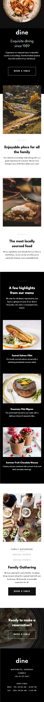
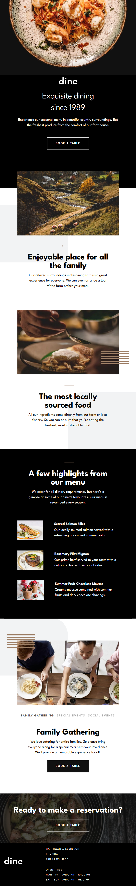
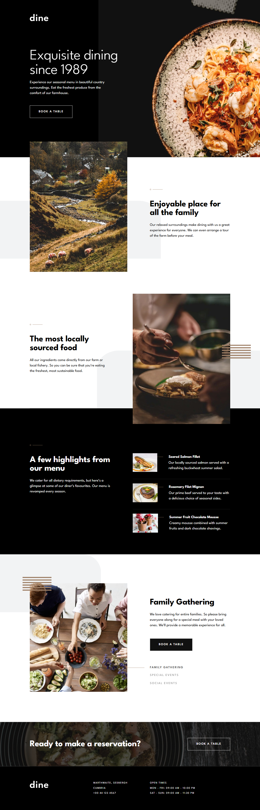
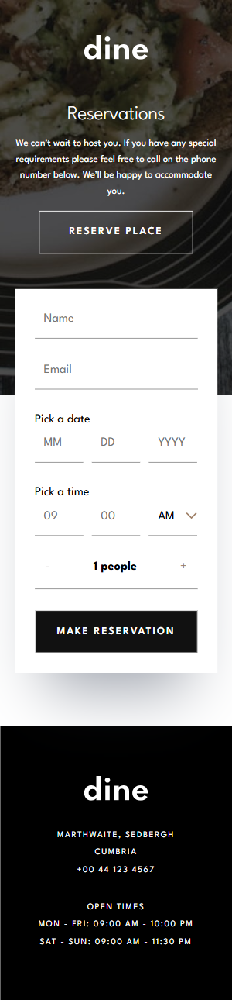
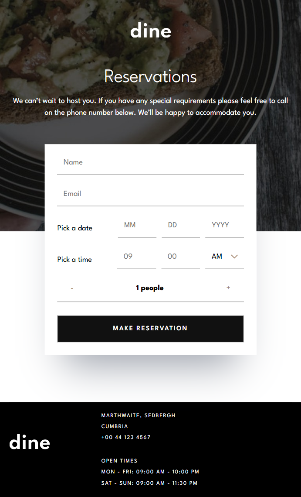
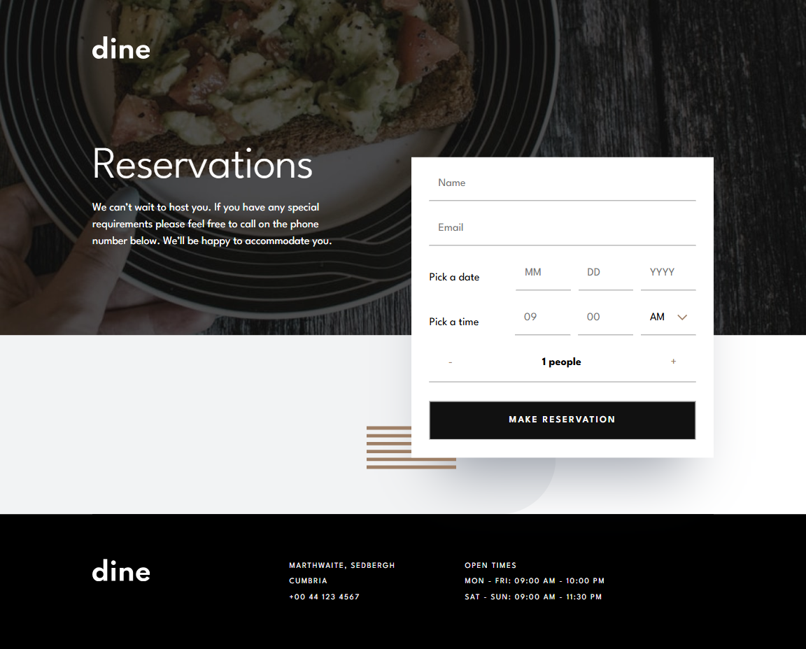

# Frontend Mentor - Dine Website Challenge solution

This is a solution to the [Dine Website Challenge challenge on Frontend Mentor](https://www.frontendmentor.io/challenges/dine-restaurant-website-yAt7Vvxt7). Frontend Mentor challenges help you improve your coding skills by building realistic projects.

## Table of contents

- [Overview](#overview)
  - [The challenge](#the-challenge)
  - [Screenshot](#screenshot)
  - [Links](#links)
- [My process](#my-process)
  - [Built with](#built-with)
  - [What I learned](#what-i-learned)
  - [Useful resources](#useful-resources)
- [Author](#author)

## Overview

### The challenge

Users should be able to:

- View the optimal layout for each page depending on their device's screen size
- See hover states for all interactive elements throughout the site
- See the correct content for the Family Gatherings, Special Events, and Social Events section when the user clicks each tab
- Receive an error message when the booking form is submitted if:
  - The `Name` or `Email Address` fields are empty should show "This field is required"
  - The `Email Address` is not formatted correctly should show "Please use a valid email address"
  - Any of the `Pick a date` or `Pick a time` fields are empty should show "This field is incomplete"

### Screenshot

### Links

- Solution URL: [https://github.com/PioKl/Dine-Restaurant-Website]
- Live Site URL: [https://piokl.github.io/Dine-Restaurant-Website/]

## My process

### Built with

- Semantic HTML5 markup
- CSS custom properties
- SCSS
- Flexbox
- Mobile-first workflow
- Framer-Motion
- [React](https://reactjs.org/) - JS library
- [Typescript](https://www.typescriptlang.org/) - JS syntax
- [Vite](https://vite.dev/) - Fast frontend build tool

### What I learned

Practice with: React (hooks, routing) and Typescript (generally and types/interface), flex, forms (validation), framer-motion
CSS: transforms, positioning

### Useful resources

- [Clamp Calculator](https://www.marcbacon.com/tools/clamp-calculator/) - To clamp fonts

## Author

- Website - [PioKl](https://github.com/PioKl)
- Frontend Mentor - [@PioKl](https://www.frontendmentor.io/profile/PioKl)
